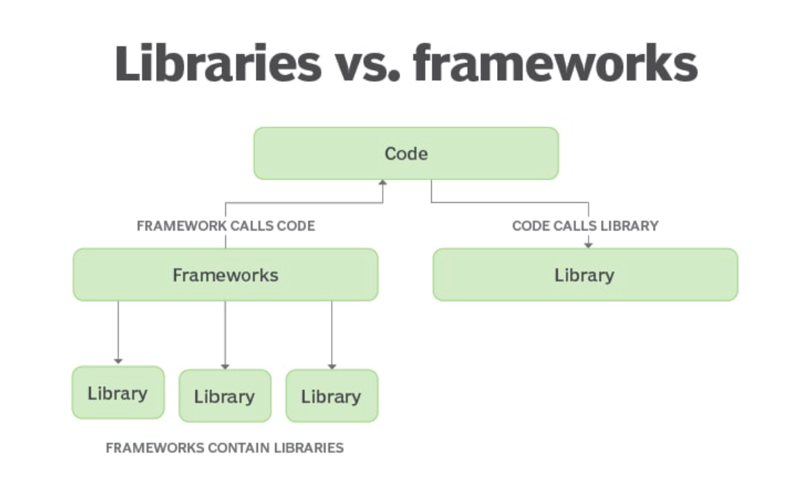
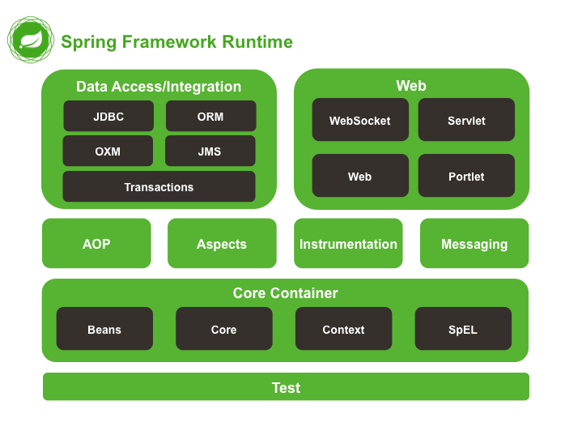
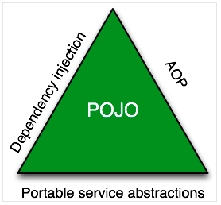

# Spring Framework Overview

## Framework vs Library



### _둘의 차이는?_

> 프레임워크는 라이브러리의 조합, 모음

- 공통점
    - 특정 문제를 일반적인 방법으로 해결하기 위한 코드 제공
    - 재활용 가능
- 차이점
    - Framework는 원하는 기능을 구현하기 위하여 일정한 형태(골격)를 제공
    - 기능(함수)의 집합
    - **주도권**
    - 레디스 영속 프레임워크 vs 레디스 클라이언트 라이브러리


### 주도권
- Framework
    - 흐름 제어권을 프레임워크가 가지고 있음.
    - 제공하는 골격대로 개발을 해야 한다.

- Library
    - 흐름 제어권을 내가 가지고 있을 수 있음. (body만 parsing할지 header도 parsing할지 마음대로 조작할 수 있다)
    - 함수의 집합


## 왜 프레임워크를 사용해야 할까?

- 기능적 요구사항과 비기능적 요구사항
    - 기능적 요구사항: 계속해서 반복한다.
    - 비기능적 요구사항: 계속 변한다.
    - 프레임워크를 사용하면 DbConnection -> commit/rollback이 반복되는 걸 annotation으로 해결 가능..
- 생산성
- 속도
- 결과
    - 실수를 줄여줄 수 있음.
    - 반복되는 기능
    - 비즈니스 로직에 집중
    - 빠른 개발


## 어떤 프레임워크를 써야 할까?

> 프레임워크를 한 번 도입하게 되면 걷어내는 일은 매우 어렵다..

- `표준(standard) == 사실상 표준(defecto)`
- 신뢰성있는 프레임워크 : 꾸준히 버전업, 기능 추가, 버그가 고쳐지는 프레임워크
- 생태계 : 이 프레임워크를 사용해서 파생된 서브 프로젝트들이 있는가?

## Spring Framework
> Java Enterprise 개발을 편하게 해주는 오픈소스 경량급 애플리케이션 프레임워크
> - 엔터프라이즈 개발 : 서비스를 하기 위해서 2개 이상의 애플리케이션이 필요한 것을 의미함
    >  - 실질적으로 애플리케이션을 개발하고 시장에 나오고 사용을 하면 모두 엔터프라이즈

- lightweight solution
- modular
- non-intrusive : Framework 코드를 내 코드에 들어오지(침투하지) 않는다.
- handles the infrastructure
- POJO(plain old Java objects)를 사용해서 엔터프라이즈 개발 가능


## Spring Framework 특징

### 경량 컨테이너로서, Spring Bean을 직접 관리
- Spring Bean **객체의 라이프 사이클**을 관리
    - `Spring Bean`: Spring Container가 관리하는 Obejct
    - 객체이지만 new로 생성하지 않고 Spring Framework - Application Context가 생성하고 가지고 있음.
- `Container` - Spring Bean 객체의 생성, 보관, 제거에 관한 모든 일을 처리

### POJO(Plain Old Java Object) 기반의 프레임워크
- 일반적인 J2EE 프레임워크와 비교하여 특정한 인터페이스를 구현하거나 상속받을 필요 없음

### 제어 역전(IoC: Inversion of Control)
- 흐름의 제어권이 사용자가 아닌 프레임워크에 있다.
- 필요에 따라 Spring에서 사용자의 코드를 호출
- 의존성 주입(DI: Dependency Injection)
- DDD(Domain Driven Development), TDD(Test Driven Development)와 같은 프로그래밍 개발론에도 적합한 프레임워크

### 관점 지향 프로그래밍(AOP: Aspect-Oriented Programming) 지원
- 복잡한 비즈니스 영역의 문제와 공통된 지원 영역의 문제 분리
- 문제 해결에 집중
- e.g. DB Transaction, Logging, Security etc.

### 영속성과 관련된 다양한 서비스
- e.g. MyBatis, Hibernate, JdbcTemplate etc.
- DB와 같은 외부 저장소에 저장

### Spring Framework Modules


_Core Container는 필수적인 존재_


### Spring Boot vs Spring Core ?

- 대세는 Spring Boot Project
    - 대용량 서비스, Cloud, MSA etc.
- 하지만, 기본은 Spring Core
    - Spring Core로 모듈을 쌓아 올려야 하는 단점이 존재

### Bill-Of-Material
- Sub project에 대한 모든 버전을 명시
- 실제로 application에 넣어야하는 모듈은 다음과 같이 명시
```xml
    <dependencyManagement>
        <dependencies>
            <dependency>
                <groupId>org.springframework</groupId>
                <artifactId>spring-framework-bom</artifactId>
                <version>5.3.17</version>
                <type>pom</type>
                <scope>import</scope>
            </dependency>
        </dependencies>
    </dependencyManagement>

    <dependencies>
        <dependency>
            <groupId>org.springframework</groupId>
            <artifactId>spring-context</artifactId>
        </dependency>
    </dependencies>
```

### The Spring Triangle

- DI (Dependency Injection)
- AOP (Aspect-Oriented Programming)
- PSA (Portable Service Abstraction): 기능으로 추상화 - 여러개의 구현체가 존재(Spring Data Jdbc, MyBatis, Hibernate와 같이)



**중심은 POJO(Plain Old Java Object)**
