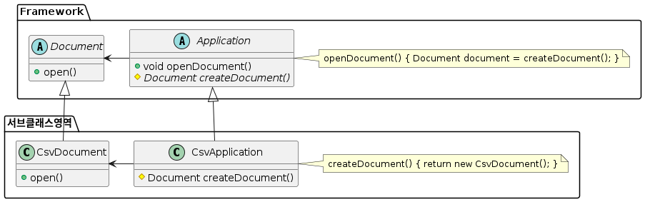

# Spring Framework Dependency Injection (XML)

## 의존성 주입 (Dependency Injection)
- IoC 패턴 중 하나
- Object 간의 의존성을 낮춘다.
- 외부에서 객체를 생성하고 전달


## Factory Method (DI의 예)

### 문제 (Problem)
- 사용자에게 다양한 문서를 읽어서 객체로 반환하는 프레임워크를 개발한다고 가정해보자.
- Application 클래스와 Document 클래스로 추상화
  - 이 두 추상 클래스를 통해 문서의 종류에 따라 대응할 수 있음.
- Application 클래스는 언제 Document 클래스를 생성하고 사용해야 하는지는 알 수 있지만, 프레임워크에서 구체적으로 어떤 문서를 처리할 Document를 생성해야 하는지는 결정할 수 없다.

### 해결법 (Solution)
- Document의 서브 클래스 중 어느 클래스를 생성하는지는 Application 클래스의 서브 클래스가 결정하도록 설계
- Application 클래스의 서브 클래스는 추상화된 createDocumnet() Method를 정의하여 적당한 Documnet 클래스의 서브 클래스를 반환
- createDocument() method를 `factory method`라고 한다.




## Dependency Injection

### 정의 
> 프로그래밍에서 구성 요소간의 의존 관계가 소스코드 내부가 아닌 외부의 설정파일 등을 통해 정의되게 하는 디자인 패턴 중 하나

- DI는 디자인 패턴이고 핵심 원칙은 의존성 이슈로부터 행동(behavior)를 분리시키는 것이다.
- DI는 IoC의 구현일 뿐이다.

### Spring Framework Dependency Injection(Bean Wiring) 방법
1. Constructor Injection
2. Setter Injection
3. Field Injection


## 생성자 주입 (Constructor Injection)
```java
    // 생성자 주입 방식을 사용 -> 주입 대상 스프링빈에 적절한 생성자 필요
    public MessageSendService(MessageSender messageSender) {
        this.messageSender = messageSender;
    }
```

- MessageSendService를 빈으로 등록
- `<constructor-arg ref={Bean} />`을 통해 생성자에 주입
```xml
        <bean id="messageSendService" class="com.nhnacademy.edu.springframework.di.constructor.MessageSendService">
            <constructor-arg ref="smsMessageSender"/>
        </bean>
```

## 수정자 주입 (Setter Injection)
- 클래스를 생성할 때 setter 메서드를 작성하여 의존성 주입
```java
    // final keyword 이면 객체를 생성한 뒤 값을 할당할 수 없으므로 빼준다.
    private MessageSender messageSender;

    // Setter Injection은 기본 생성자가 필수
    public MessageSendService() {
    }

    public MessageSendService(MessageSender messageSender) {
        this.messageSender = messageSender;
    }

    public void setMessageSender(MessageSender messageSender) {
        this.messageSender = messageSender;
    }
```

- setter 메서드를 이용하여 빈 주입
```xml
        <bean id="messageSendService"
              class="com.nhnacademy.edu.springframework.di.setter.MessageSendService">
            <property name="messageSender" ref="smsMessageSender"/>
        </bean>
```

## Autowired Injection
- autowired 속성을 사용하여 자동으로 주입
- 아래의 세가지 방식으로 사용할 수 있음
  - byType
  - byName
  - constructor

### Autowired Injection : byType
```xml
    <!--    byType으로 autowire 를 하려면 해당되는 type 의 bean 이 1개만 존재해야 합니다.-->
    <!--    <bean id="englishGreeter" class="com.nhnacademy.edu.springframework.greeting.service.EnglishGreeter" scope="singleton">-->
    <!--    </bean>-->

    <bean id="koreanGreeter" class="com.nhnacademy.edu.springframework.greeting.service.KoreanGreeter" scope="prototype">
    </bean>

    <bean id="greetingService" class="com.nhnacademy.edu.springframework.greeting.GreetingService" autowire="byType">
    </bean>
```

### Autowired Injection : byName
```xml
    <bean id="englishGreeter" class="com.nhnacademy.edu.springframework.greeting.service.EnglishGreeter" scope="singleton">
    </bean>

    <bean id="koreanGreeter" class="com.nhnacademy.edu.springframework.greeting.service.KoreanGreeter" scope="prototype">
    </bean>

    <bean id="greetingService" class="com.nhnacademy.edu.springframework.greeting.GreetingService" autowire="byName">
    </bean>
```

- `byName` 속성을 사용하였기 때문에 setter 메서드명을 setKoreanGreeter로 수정

```java
    public void setKoreanGreeter(Greeter greeter) {
    System.out.println("setGreeter invoked!");
    this.greeter = greeter;
}
```

## 필드 주입 (Field Injection)