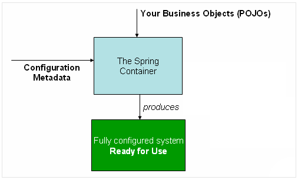
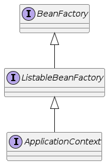
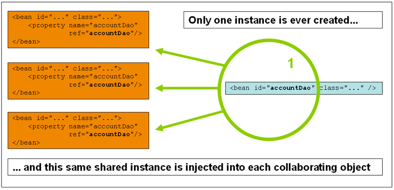
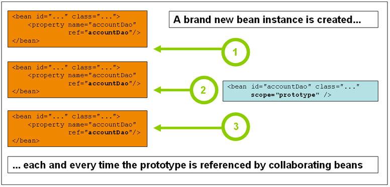

# Spring Inversion of Control

## IoC : Inversion of Control

- 제어권을 프레임워크가 갖는 것 == 개발자는 제어권이 없다 == 제어(Control)가 역전(Inversion) 되었다.
    - 제어: 프로그램의 흐름, 객체의 생성 및 파기

- IoC 관점에서 각자의 역할
    - 개발자는 코드의 흐름이나 객체 생성에 관련된 코드를 직접 작성 X (ex. new를 통해 Spring Object를 만들지 않는다.)
    - 개발자는 프레임워크가 제공하는 **설정 방법**을 사용하여 **코드를 설정만 한다.**
    - 프레임워크는 이 **설정**을 보고 **객체를 생성**하고 **코드가 동작하는 순서를 결정**하여 실행

### 헐리우드 원칙

프레임워크는 애플리케이션 코드를 **호출**한다.

> 우리에게 전화(call)하지 마세요. 우리가 당신을 부를(call) 것입니다.

### IoC의 예 - 흐름의 제어역전 (template method pattern)

- template(형판, 틀) + method + pattern
- 추상 클래스(틀)에 템플릿에 해당하는 메서드에서 실행의 흐름이 이미 결정되어 있음.
- 각 메서드가 어떤 일을 할 것인지는 개발자의 구현에 따라 결정됨.
- preProcess() -> mainProcess() -> postProcess()

_ex. javax.servlet.Filter interface_

```java
public interface Filter {

    public default void init(FilterConfig filterConfig) throws ServletException {
    }

    public void doFilter(ServletRequest request, ServletResponse response,
                         FilterChain chain) throws IOException, ServletException;

    public default void destroy() {
    }
}
```

## ApplicationContext

### Spring IoC Container



- `org.springframework.context.ApplicationContext` interface를 의미한다.
- 객체를 생성(**instantiating**)하고, 객체를 설정(**configuring**)하고, 객체를 조립(**assembling**)
- configuration metadata(설정 메타 데이터)를 통해 어떻게 객체를 생성, 설정, 조립될지 정해진다!

### Spring Bean

> **스프링 IoC Container**에 의해 생성되고 조립되고 다른 방면으로 관리가 되는 자바 객체를 의미한다

- Spring Bean은 name, (class) type, object로 구성되어있다.
- Spring Framework에서 관리하는 객체는 Spring Bean이다.

### cf.) JavaBeans

- public default(no argument) constructor
- getter/setter
- implement java.io.Serializable

_**Spring Beans != JavaBeans**_

## Bean Factory vs ApplicationContext

- Spring IoC Container = { Bean Factory | ApplicationContext }



### Bean Factory

- Spring Bean을 만들고 관리하는 것 까지만 Bean Factory API가 제공

### ApplicationContext

- Bean Factory functionality + @

| Feature                                                    | Bean Factory | ApplicationContext |
|------------------------------------------------------------|--------------|--------------------|
| Bean instantiation/wiring                                  | Yes          | Yes                |
| Integrated lifecycle management                            | No           | Yes                |
| Automatic BeanPostProcessor registration                   | No           | Yes                |
| Automatic BeanFactoryPostProcessor registration            | No           | Yes                |
| Convenient MessageSource access (for Internationalization) | No           | Yes                |
| Built-in ApplicationEvent publication mechanism            | No           | Yes                |

## ApplicationContext

### 정의

- `central interface` within a Spring application for providing configuration information to the application
- Configuration Metadata이 xml인지, annotation인지, groovy이던간에 ApplicationContext가 관리

### ApplicationContext 역할

- Spring Bean 생성
- Spring Bean 파기
- Spring Bean 주입

## Bean Scope

- singleton - **deafult**
    - JVM 내부에서 단 한 개의 객체가 있는 것
    - Spring ApplicationContext 내부에 bean이 단 한개만 존재함
- prototype
    - 조립이 될 때 마다 새로 생성됨

- Only valid in the context of a web-aware Spring ApplicationContext
    - request - lifecycle of a single HTTP request
    - session - lifecycle of an HTTP Session
    - application - lifecycle of a ServletContext
    - websocket - lifecycle of a WebSocket
    - global session - portlet (dropped in spring 5)

### Singleton vs Prototype

- Singleton



- Prototype



## 객체의 생명주기 callbacks - 초기화

```java
public interface InitializingBean {
    void afterPropertiesSet() throws Exception;
}
```

- org.springframwork.beans.factory.InitializingBean 인터페이스를 구현한 빈은 생성시 초기화 작업을 수행할 수 있음.
- `afterPropertiesSet()`이라는 단일 메서드를 가짐
- xml bean에 init-method로 설정
- DbConnection Pool을 끊을 때 사용
- 이 방식은 컴포넌트에 스프링 프레임워크의 의존성이 발생함으로 권장하지 않는다.

## 객체의 생명주기 callbacks - 소멸

```java
public interface DisposableBean {
    void destroy() throws Exception;
}
```
- org.springframework.beans.factory.DisposableBean 인터페이스를 구현한 빈은 소멸시에 호출된다.
- `destroy()`라는 단일 메서드를 가짐
- xml bean에 destroy-method로 설정

