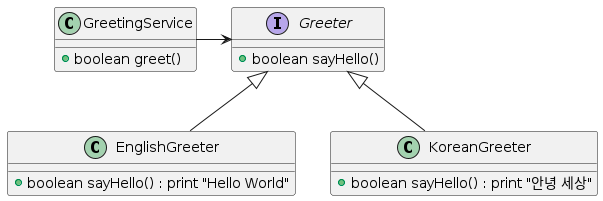

# 다형성 (Polymorphism)

```java
public class GreetingService {
    private Greeter greeter; // <--- Greeter는 부모 클래스 or 인터페이스일 수 있다.
}
```


- Java에서 변수는 부모 클래스 타입이나 인터페이스 타입에 할당될 수 있음.
- 실제 어떤 메서드가 실행될 것인지는 메시지를 수신하는 객체의 클래스가 무엇인가에 따라 결정됨
- 이러한 것이 다형성이다.