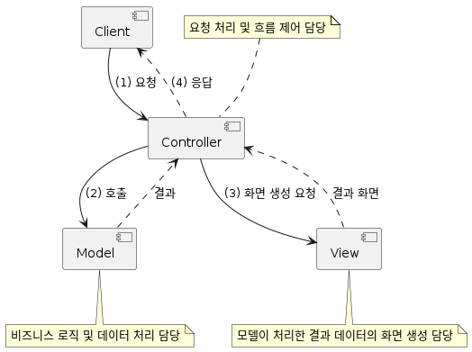
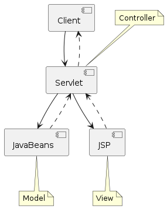
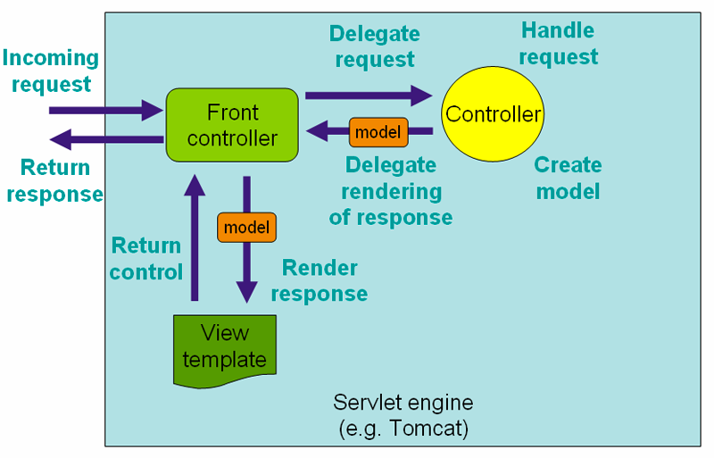

## 목차

1. Spring MVC
2. Controller
3. 예외 처리 (Exception Handling)
4. 입력 값 검증 (Validation)

## 1. Spring MVC

### MVC Pattern

> Pattern : 설계의 예시



- 웹의 요청을 처리하는 것, 모델 처리하는 것, 뷰 처리가 모두 함께 존재했던 경우가 있다.
- 뷰를 수정한다고 가정을 한다면, 컨트롤러와 모델도 같이 수정해야하는 문제가 발생
- 이를 해결하기 위해 MVC 패턴이 등장

### JavaBeans/JSP/Servlet (JSP Model2)



- Controller : Servlet
- View : JSP
- Model : JavaBeans

> NHN Shopping Mall에서는 Front Controller 패턴을 사용한 것을 기억해보자

## DispatcherServlet

- Spring MVC Framework의 중심이 되는 Servlet
- `Controller`로 향하는 모든 웹 요청의 entry point (진입점)
- `Front Controller` 디자인 패턴의 표현



## Root ApplicationContext

- `org.springframework.web.context.ContextLoaderListener`
    - implements `ServletContextListener`

```xml

<listener>
    <listener-class>org.springframework.web.context.ContextLoaderListener></listener-class>
</listener>

<context-param>
<param-name>contextClass</param-name>
<!-- ... -->
</context-param>

<context-param>
<param-name>contextConfigLocation</param-name>
<!-- ... -->
</context-param>
```

## Servlet ApplicationContext

- DispatcherServlet: Spring MVC의 default servlet

```xml

<servlet>
    <servlet-name>dispatcherServlet</servlet-name>
    <servlet-class>org.springframework.web.servlet.DispatcherServlet</servlet-class>
    <init-param>
        <param-name>contextClass</param-name>
        <!-- ... -->
    </init-param>
    <init-param>
        <param-name>contextConfigLocation</param-name>
        <!-- ... -->
    </init-param>
</servlet>
```

> #### ApplicationContext vs WebApplicationContext**
> WebApplicationContext = ApplicationContext + ServletContext

## Configuration

### `@EmableWebMvc`

- 웹을 처리하기 위한 기본 동작은 모든 설정이 된 것이다.
- Customizing을 하고 싶다면, `WebMvcConfigurer`를 구현하면 된다.
    - `add...` : 새로운 빈이나 오브젝트를 추가하는 것
    - `configure...` : 설정 작업을 하는 것

- `@EnableWebMvc`를 사용하지 않고 커스터마이징을 하고싶다면 `WebMvcConfigurationSupport` 클래스를 상속
- cf.) Spring Boot는 `WebMvcAutoConfiguration`가 자동으로 설정을 해줌

## WebApplicationInitializer

### SpringServletContainerInitializer

```java

@HandlesTypes(WebApplicationInitializer.class)
public class SpringServletContainerInitializer implements ServletContainerInitializer {
    @Override
    public void onStartup(Set<Class<?>> set, ServletContext servletContext) {
        // ...
    }
}
```

- 최종적으로 @HandlesTypes에 의해 WebApplicationInitializer를 구현한 클래스들을 찾아서 onStartup 메소드를 호출

## Controller

- MVC 패턴에서의 `Controller`
    - 요청 처리 및 흐름 제어 담당
- Front Controller 패턴에서 `Command` interface 구현 클래스에 해당된다.

### Controller 구현

- `@Contoller`라는 stereo type bean 사용 -> component scan의 대상
    - 다른 어노테이션을 끌어안고 있는 경우 - meta annotation

```java

@Controller
public class HomeController {

    @GetMapping("/")
    public String index() {
        return "index";
    }
}
```

- `@RestController` = @Controller + @ResponseBody
    - `@Controller` : view 이름을 반환하면 `viewResolver`가 view를 처리
    - `@RestController` : HttpMessageConverter가 응답 객체를 처리

```java

@RestController
@RequestMapping("/persons")
public class PersonController {
    /*
            GET /persons/12345

            HTTP/1.1 200 OK
            Content-type: application/json;charset=UTF-8

            {
                "name": "dongmyo",
                "age": 19,
                "address": "Ulsan, Korea"
            }
     */
    @GetMapping("/{id}")
    public Person getPerson(@PathVariable Long id) {
        // ...
    }

    /*
            POST /persons
            {
                "name": "dongmyo",
                "age": 19,
                "address": "Ulsan, Korea"
            }

            HTTP/1.1 201 Created
     */
    @PostMapping
    @ResponseStatus(HttpStatus.CREATED)
    public void add(@RequestBody Person person) {
        // ...
    }
}
```

## Request Mapping (`@RequestMapping`)

- 요청을 Controller 메서드에 맵핑

```java
@RequestMapping(value = "/persons", method = RequestMethod.GET)
@RequestMapping(value = "/persons", method = RequestMethod.POST)
@RequestMapping(value = "/persons", method = RequestMethod.PUT)
@RequestMapping(value = "/persons", method = RequestMethod.DELETE)
@RequestMapping(value = "/persons", method = RequestMethod.PATCH)
@RequestMapping(value = "/persons", method = RequestMethod.HEAD)
@RequestMapping(value = "/persons", method = RequestMethod.OPTIONS)
@RequestMapping(value = "/persons", method = RequestMethod.TRACE)
```

_위의 코드와 같이 HTTP Method Mapping은 다음과 같이 사용할 수 있다._

```java
@GetMapping ==@RequestMapping(method = RequestMethod.GET)
@PostMapping ==@RequestMapping(method = RequestMethod.POST)
@PutMapping ==@RequestMapping(method = RequestMethod.PUT)
@DeleteMapping ==@RequestMapping(method = RequestMethod.DELETE)
@PatchMapping ==@RequestMapping(method = RequestMethod.PATCH)
```

### request parameter in Request Mapping

- id parameter가 있는 경우에만

```java
@RequestMapping(method = RequestMethod.GET, params = {"id"})
```

- id parameter가 없는 경우에만

```java
@GetMapping(params = {"!id"})
```

- type parameter 값이 raw인 경우에만

```java
@GetMapping(params = "type=raw")
```

- type parameter 값이 raw가 아닌 경우에만

```java
@GetMapping(params = "type!=raw")
```

> `@PathVariable`을 사용하여 request parameter를 메서드 파라미터로 받을 수 있다.

## Controller Method - 사용 가능한 method arguments

- HttpServletRequest, HttpServletResponse, HttpSession, WebRequest
- Locale
- InputStream, OutputStream, Reader, Writer
- `@PathVariable`, `@RequestParam`, `@RequestHeader`, `@CookieValue`, `@Value`
- Map, Model, ModelMap, `@ModelAttribute`, `@RequestBody`
- Errors, BindingResult, ...

## Controller Method - 사용 가능한 return type

- ModelAndView, View
- Map, Model, ModelMap
- String
- void
- `@ResponseBody`
- POJO

## Model

- `java.tuil.Map` interface
- `org.springframework.ui.Model` interface
- `org.springframework.ui.ModelMap` class

### 실제 처리되는 내용

- `Model`에 설정한 속성(attribute)에 `View - request.attribute`로 전달됨

_**Map**_

```java
// NowController.java
@GetMapping("/now")
public String now(Map<String, String> model) {
    model.put("time", new Date().toString());
    return "now";
}
```

```java
// now.jsp
<%=request.

getAttribute("time")%>
```

_**Model**_

```java

@GetMapping("/now")
public String now(Model model) {
    model.addAttribute("time", new Date().toString());
    return "now";
}
```

_**ModelMap**_

```java

@GetMapping("/now")
public String now(ModelMap modelMap) {
    modelMap.put("time", new Date().toString());

    return "now";
}
```

## ModelAndView

> 말 그대로 Model + View

```java

@GetMapping("/some-request")
public ModelAndView doSomething() {
    ModelAndView mav = new ModelAndView("viewName");
    mav.addObject("name", "value");
    // ...

    return mav;
}
```

## @RequestParam

- 요청 URL

```http request
GET http://localhost:8080/now?name=seungjo
```

- Controller Method

```java

@GetMapping("now")
public String now(@RequestParam(name = "name") String name,
                  Model model) {
    model.addAttribute("time", new Date().toString());
    model.addAttribute("name", name);

    return "now";
}
```

## @PathVariable

- 요청 URL의 Resource(Path)을 처리하기 위한 어노테이션
- @RequestMapping의 path에 변수명을 입력받기 위한 place holder 필요

## @RequestHeader

- 요청의 HTTP header를 처리하기 위한 어노테이션

### Ex.)

- 요청

```http request
GET /some-request HTTP/1.1
Host: localhost:8080
User-Agent: Mozilla/5.0 (Windows NT 10.0; Win64; x64) AppleWebKit/537.36 (KHTML, like Gecko) Chrome/100.0.4896.127 Safari/537.36
Controller Method
```

```java

@GetMapping("/some-request")
public List<User> getUsers(@RequestHeader(name = "User-Agent") String userAgent) {
// ...
}
```

## @CookieValue

- HTTP Cookie를 처리하기 위한 어노테이션

```java

@GetMapping("/some-request")
public List<Person> getPersons(@CookieValue(name = "SESSION") String sessionId) {
    // ...
}
```

## URL Pattern

### In Servlet

- `/`: default servlet
- `/*` : 하위 경로 전체
    - /foo/bar/*
    - /foo/bar/1 (O)
    - /foo/bar/1/2/3.html (O)
    - /foo/var (X)

- `*.do` : 확장자 매칭

### In Spring MVC

Ant style Pattern 지원

- `?` : 1글자 매칭
    - ex. `c?t` : cat, cut (O), cert (X)
- `*` : 0글자 이상 매칭
    - ex. `/users/*` : /users/1, /users/2 (O)
- `**` : 0글자 이상 하위 겨올 매칭

## @ModelAttribute

- 메서드 인자로 선언 : 모델에서 속성 값을 추출해 올 때 사용

# 예외 처리 Exception Handling

## @ExceptionHandler

- 예외 처리 메서드에 annotation 지정

```java

@ExceptionHandler({UserNotFoundException.class})          // <-- 어떤 예외를 처리할 것인지 선언
// --> method argument로 여러 객체들을 선언할 수 있다.
public String handleException(UserNotFoundException ex, HttpServletResponse response) {
    // ...

    // --> method return value로 여러 객체들을 반환할 수 있다.
    return "error";
}
```

### @ExceptionHandler - method arguments

- HttpServletRequest, HttpServletResponse, HttpSession, WebRequest
- Locale
- InputStream, OutputStream, Reader, Writer
- Map, Model, ModelMap

### @ExceptionHandler - return types

- ModelAndView, View
- Map, Model, ModelMap
- String
- void
- `@ResponseBody`
- POJO

## Controller 기반 예외 처리

### 1. `@ExceptionHandler` + `@ResponseStatus`

```java

@ExceptionHandler(UserNotFoundException.class)
@ResponseStatus(HttpStatus.NOT_FOUND)
public void notFound() {
    // nothing to do
}
```

### 2. `@ExceptionHandler` + View

```java

@ExceptionHandler(UserNotFoundException.class)
@ResponseStatus(HttpStatus.NOT_FOUND)
public String notFound(UserNotFoundException ex, Model model) {
    model.addAttribute("exception", ex);
    return "error";
}
```

### 3. `@ExceptionHandler` + `@ResponseBody` + `HttpMessageConverter

```java

@ExceptionHandler(Exception.class)
@ResponseBody
public ErrorDto handleException(Exception ex) {
    // ...
    // 예외를 처리하고 에러 메세지를 담은 `ErrorDto` 객체를 생성해서 반환
    return errorDto;
}
```

## 전역 예외 처리

### @ControllerAdvice

- 모든 Controller에서 나오는 Exception 처리를 하는 방법

```java

@ControllerAdvice
public class WebControllerAdvice {
    @ExceptionHandler({UserNotFoundException.class, PostNotFoundException.class})
    public String handleException(Exception ex, Model model) {
        log.error("resource not found", ex);
        model.addAttribute("exception", ex);
        return "error";
    }
}
```

# 입력 값 검증 (Validation)

## Bean Validation

- Java SE, Java EE 플랫폼에서 사용되는 `JavaBeans`에 대한 검증용 Java API Spec.

#### API

```xml

<dependency>
    <groupId>jakarta.validation</groupId>
    <artifactId>jakarta.validation-api</artifactId>
    <version>2.0.2</version>
</dependency>
```

#### Implementation

```xml

<dependency>
    <groupId>org.hibernate.validator</groupId>
    <artifactId>hibernate-validator</artifactId>
    <version>6.2.3.Final</version>
</dependency>
```

### Bean Validation Annotation

| Annotation |                     설명                      | spec  |
|------------|:-------------------------------------------:|-------|
| @NotNull   | 	not null 검증.<br/> empty string 은 검사하지 못한다. | 	1.0+ |
| @Pattern   |   	regular expression 과 match 되는지 검사한다.	    | 1.0+  |  
| @Past      |                	과거의 날짜인지 검증	                | 1.0+  |
| @Min       |         	대상 값이 @min 값보다 크거나 같아야 한다.         | 	1.0+ | 
| @Max       |         대상 값이 @max 값보다 작거나 같아야 한다.          | 	1.0+ |
| @Length    |        	문자열의 길이가 min 과 max 사이에 존재해야함        | 	X    |
| @NotEmpty  |           	대상 값의 사이즈가 0보다 커야 한다.	           | 2.0+  |
| @NotBlank  |       	대상 값을 trim 후 그 사이즈가 0보다 커야 한다.       | 	2.0+ | 
| @Email     |           	대상값이 이메일형식인지 아닌지 확인.	            | 2.0+  |


### Bean Validation 적용
- Controller Method signature 에서 
  - 요청 객체에 @Valid 또는 @Validated annotation 적용하고 
  - 바로 그 다음 argument로 BindingResult 또는 Errors 객체를 선언한 후
- Controller Method 본문에서 
  - 앞서 선언한 BindingResult 또는 Errors 객체를 이용해서 validation 결과 확인

```java
public String modifyUser(@Valid @ModelAttribute UserModifyRequest userRequest,
                         BindingResult bindingResult) {
    if (bindingResult.hasErrors()) {
        throw new ValidationFailedException(bindingResult);
    }

    // ...
}
```

## Spring's Validation

### `Validator` interface
- `org.springframework.validation.Validator` interface 사용
```java
public interface Validator {
	boolean supports(Class<?> clazz);
	void validate(Object target, Errors errors);
}
```