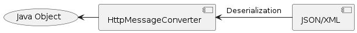
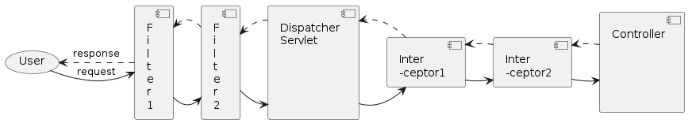
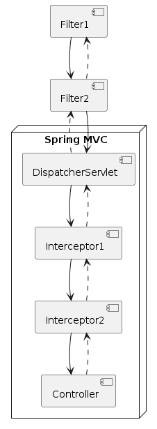

# HttpMessageConverter

- 자바 객체와 HTTP 요청 / 응답 body를 변환하는 역할




## `HttpMessageConverter` interface

```java
public interface HttpMessageConverter<T> {
    boolean canRead(Class<?> clazz, @Nullable MediaType mediaType);

    boolean canWrite(Class<?> clazz, @Nullable MediaType mediaType);

    List<MediaType> getSupportedMediaTypes();

    T read(Class<? extends T> clazz, HttpInputMessage inputMessage) /*..*/;

    void write(T t, @Nullable MediaType contentType, HttpOutputMessage outputMessage) /*..*/;
}
```

## @RestController

- @RestController = @Controller + @ResponseBody
- Json 형식으로 반환함

## @ResponseBody

- handler method의 return value를 HttpMessageConverter를 통해 직렬화해서 response body로 전달
- @RestController = @Controller + @ResponseBody
- 일반 @Controller 클래스에도 method 레벨에서 @ResponseBody 가능

### ResponseEntity

- `@ResponseBody` + http status + response headers

```java
@GetMapping("/users/{userId}")
public ResponseEntity<User> getUser(@PathVariable("userId") String userId) {
    User user = userRepository.getUser(userId);

    return ResponseEntity.ok().body(user);
}

```

## @RequestBody

- request body를 읽어와서 `HttpMessageConverter`를 통해 deserialize해서 객체로 전달받기 위한 용도

```java

@PostMapping("/api/members")
@ResponseStatus(HttpStatus.CREATED)
public void createMember(@RequestBody Member member) {
    // ...
}
```

# Spring MVC Components


## Handler

- `Controller`라고 하는 인터페이스나 `HttpRequestHandler`를 구현한 것
- `Controller`에 있는 메서드라고 생각하자

## HandlerMapping

서버로 들어온 요청을 어느 핸들러로 전달할지 결정하는 역할

- `BeanNameUrlHandlerMapping`
    - Bean Name + Url + HandlerMapping

- `SimpleUrlHandlerMapping`
    - Simple Url + HandlerMapping

- `RequestMappingHandlerMapping`
    - @RequestMapping + HandlerMapping

# ViewController / RedirectViewController

### Configuration

```java
public class WebConfig implements WebMvcConfigurer {
    // ...

    @Override
    public void addViewControllers(ViewControllerRegistry registry) {
        registry.addViewController("/").setViewName("index");
        registry.addRedirectViewController("/this-is-home", "/");
    }
}
```

## ViewResolver

문자열 기반의 view 이름을 토대로 실제 View 구현을 결정하는 역할!

### ViewResolver 관련 Component

### 1. LocaleResolver / LocaleContextResolver

- 렌더링시 국제화 지원을 위한 Locale과 Timezone을 결정하는 역할
    - AcceptHeaderLocaleResolver
    - CookieLocaleResolver
    - SessionLocaleResolver

### 2. ThemeResolver

- 뷰 렌더링시 어떤 테마를 사용할지 결정하는 역할
    - CookieThemeResolver
    - FixedThemeResolver
    - SessionThemeResolver

#### 3. RequestToViewNameTranslator

- 핸들러(Controller - Method)가 아무것도 리턴하지 않았을 때 view 이름을 결정하는 역할

### 4. HandlerExceptionResolver

- 요청 처리 과정에서 발생하는 예외를 제어하고자 할 때 사용
    - `DefaultHandlerExceptionResolver` : 표준 Spring 예외를 결정하고 예외에 해당하는 HTTP 상태코드 응답

### 5. MultipartResolver

- 멀티파트 요청을 처리하는 구현을 결정하는 역할

### 6. FlashMapManager

- redirect와 같이 하나의 요청에서 다른 요청으로 속성 값을 전달하는데 FlashMap을 사용할 수 있는 mechanism을 제공

# HandlerInterceptor



- Servlet Filter와 유사
    - DispatcherServlet이 Controller를 호출하기 전/후에
    - 요청 및 응답을 참조, 가공할 수 있는 일종의 필터 역할

## HandlerInterceptor Interface

```java
public interface HandlerInterceptor {

    // handler를 실행하기 전  
    default boolean preHandle(HttpServletRequest req, HttpServletResponse resp, Object handler) /*..*/ {
        return true;
    }

    // 에러가 나면 실행되지 않음
    default void postHandle(HttpServletRequest req, HttpServletResponse resp, Object handler,
                            ModelAndView mav) /*..*/ {
    }

    // 무조건 호출이 되는 케이스                               
    default void afterCompletion(HttpServletRequest req, HttpServletResponse resp, Object handler,
                                 Exception ex) /*..*/ {
    }
}
```

# DispatcherServlet - HandlerExecutionChain 실행

## HandlerExecutionChain

- 요청을 처리할 하나의 핸들러와 이 요청에 적용될 여러 인터셉터들을 아우르는 요청 처리 객체

```java
public class HandlerExecutionChain {
    private final Object handler; // -> Controller's method
    private final List<HandlerInterceptor> interceptorList = new ArrayList<>();

    // ...
}
```

# 그러면 Servlet Filter, HandlerInterceptor 둘의 차이는?



1. DispatcherServlet을 기준으로 실행 시점이 다르다.
    - FIlter: DispatcherServlet 실행 전/후에 실행
    - HandlerInterceptor: DispatcherServlet 실행 이후에 Controller 실행 전/후에 실행

2. ApplicationContext 범위가 다르다
    - Filter: Root ApplicationContext에 등록/관리
        - FIlter는 Servlet ApplicationContext(MVC의 View나 @ExceptionHandler)를 이용할 수 없다
    - HandlerInterceptor: Servlet ApplicationContext에 등록/관리


## HandlerInterceptor 설정은 어떻게해?

```java
public class WebConfig implements WebMvcConfigurer {
    // ...

    @Override
    public void addInterceptors(InterceptorRegistry registry) {
        registry.addInterceptor(new LocaleChangeInterceptor());
    }
}
```

_예시_
```java
@EnableWebMvc
@Configuration
@ComponentScan(basePackageClasses = ControllerBase.class)
public class WebConfig implements WebMvcConfigurer {
    @Override
    public void configureViewResolvers(ViewResolverRegistry registry) {
        registry.jsp("/WEB-INF/view/", ".jsp");
    }

    // TODO #1: `LocaleResolver` 설정
    @Bean
    public LocaleResolver localeResolver() {
        return new CookieLocaleResolver();
    }

    // TODO #2: `LocaleChangeInterceptor` 추가
    //         `locale`이라는 파라미터로 전달된 값으로 locale을 변경.
    @Override
    public void addInterceptors(InterceptorRegistry registry) {
        registry.addInterceptor(new LocaleChangeInterceptor());
    }
}

```

## MessageSource (interface)

- ApplicationContext's i18n(국제화) support

```java
public interface MessageSource {
  String getMessage(String code, Object[] args, defaultMessage, Locale locale);
  String getMessage(String code, Object[] args, Locale locale) /*..*/;
  String getMessage(MessageSourceResolvable resolvable, Locale locale) /*..*/;
}
```

## MessageSource type Bean 등록
- messageSource라는 이름의 MessageSource 타입의 Bean을 등록해두면
- Spring framework에서 다국어 처리 시 이 Bean을 활용

```java
@Bean
public MessageSource messageSource() {
    ResourceBundleMessageSource messageSource = new ResourceBundleMessageSource();
    messageSource.setBasename("message");
//        messageSource.setBasenames("message", "error");

    return messageSource;
}
```

## File Upload

### Servlet 3.0 API (Servlet Version)
```java
@MultipartConfig(
    location = "/tmp/",
    maxFileSize = -1L,
    maxRequestSize = -1L,
    fileSizeThreshold = 1024
)
@Slf4j
public class FileUploadServlet extends HttpServlet {
    private static final String CONTENT_DISPOSITION = "Content-Disposition";
    private static final String UPLOAD_DIR = "/Users/user/Downloads";

    @Override
    protected void doPost(HttpServletRequest req, HttpServletResponse resp)
        throws ServletException, IOException {
        for (Part part : req.getParts()) {
            String contentDisposition = part.getHeader(CONTENT_DISPOSITION);

            if (contentDisposition.contains("filename=")) {
                String fileName = extractFileName(contentDisposition);

                if (part.getSize() > 0) {
                    part.write(UPLOAD_DIR + File.separator + fileName);
                    part.delete();
                }
            } else {
                String formValue = req.getParameter(part.getName());
                log.error("{}={}", part.getName(), formValue);
            }
        }
    }

    private String extractFileName(String contentDisposition) {
        for (String token : contentDisposition.split(";")) {
            if (token.trim().startsWith("filename")) {
                String fileName = token.substring(token.indexOf("=") + 1).trim().replace("\"", "");
                int index = fileName.lastIndexOf(File.separator);
                return fileName.substring(index + 1);
            }
        }

        return null;
    }
}
```

## Spring MVC - File Upload : MultipartResolver

1. StandardServletMultipartResolver
2. CommonsMultipartResolver

# View

## View Resolver
- Spring MVC에서는 view 이름을 문자열로 관리
- 문자열 기반의 view 이름을 토대로 실제 View 구현을 결정하는 역할

## Thymeleaf

```java
<dependency>
    <groupId>org.thymeleaf</groupId>
    <artifactId>thymeleaf-spring5</artifactId>
    <version>3.0.11.RELEASE</version>
</dependency>
```

### Thymeleaf 문법
_기본적으로 HTML5 속성을 이용_

- `${variable}` : 변수
```html 
  <span th:text="${greeting}" />
```

- `#{messageKey}` : 다국어 메시지
```html
<span th:text="#{greeting}" />
```

- `tx:text` : 텍스트 출력 (HTML escape)

- `th:utext` : 텍스트 출력 (HTML 태그가 그대로 적용)

- `th:each` : 반복문
- `th:if`, `th:unless` : 조건문
- `th:switch`, `th:case`
- `th:with` : 로컬 변수 선언

### Expression Basic Objects
- #locale
- #request
- #response
- #session
- #servletContext

### Expression Utility Objects
- #strings : 문자열 객체를 위한 utility method
- #lists : 리스트 객체를 위한 utility method
- 