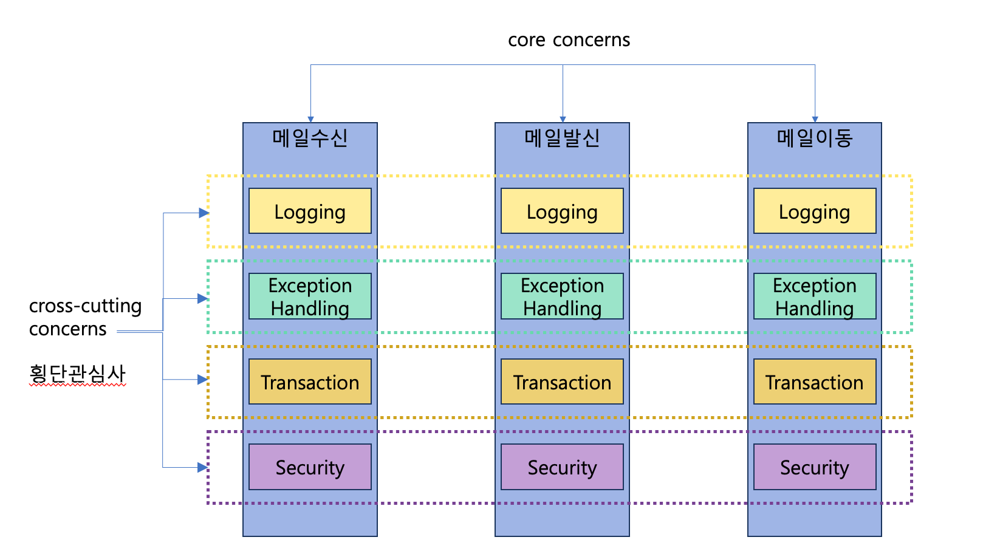
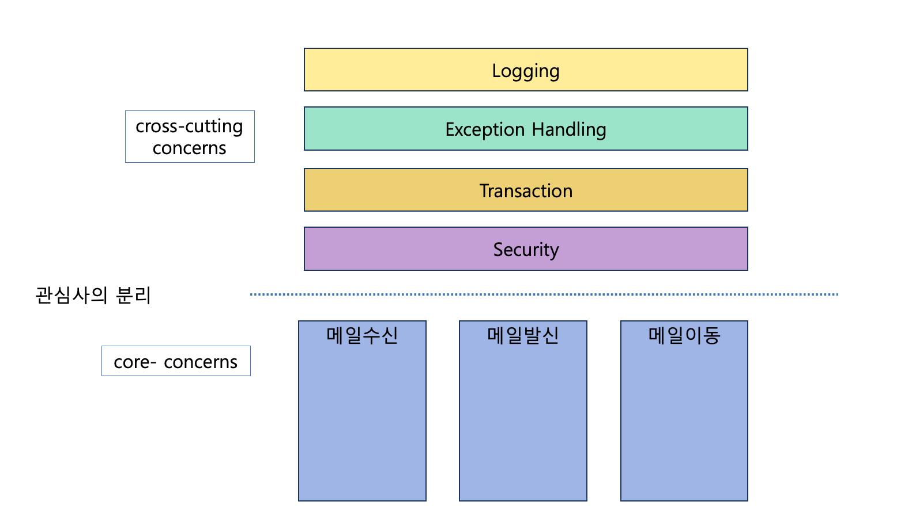
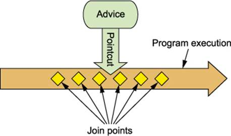

# Aspect Oriented Programming (AOP)

> 관점이라는 특별한 클래스를 만들어서 클래스와 클래스를 조합해주고 공통된 코드를 하나로 묶는다.

- 프로그램 구조를 다른방식으로 생각하게 함으로써 OOP를 보완 - OOP의 확장
- OOP에서 모듈화의 핵심 단위는 클래스이지만, AOP에서 모듈화의 핵심 단위는 `관점(aspect)` 이다.
- **관점(aspect)** : 다양한 타입과 객체에 걸친 트랜잭션 관리같은 관심(concern)을 모듈화 할 수 있게 한다.
    - crosscutting concerns(횡단 관심사) : 중복되는 관심사
    - core concerns(주요 관심사)



#### 횡단 관심사와 주요 관심사를 분리하여 관점 별로 각각 기능을 모듈화 하자



## 주요 용어

### Aspect

- 여러 클래스에 걸친 횡단 관심사 모듈 (ex. Logging, Exception Handling, Transaction etc.)
- 하나 이상의 Pointcut + Advice 조합
- Spring framework - `@Aspect`를 클래스 선언부 상단에 써준다.
- XML에서도 설정할 수 있음.

### Join Point

- 어떤 위치에 기능을 넣어야하는지 결정
- Pointcut 후보
- Spring AOP 에서는 `메서드 실행`만 대상

### Advice

- 특정 Join Point에서 Aspect가 취하는 행동
- ex. around, before, after

### Pointcut

- Advice를 적용할 Join Point를 선별하는 작업
- Advice는 Pointcut 표현식과 연결, Pointcut이 매치한 Join Point에서 실행

### Target Object

- 부가 기능을 부여할 대상
- 하나 이상의 Aspect로 Advised된 객체 (Advised Object)
- ex. Logging이라는 기능이 추가된 대상

### AOP Proxy

- aspect 계약 (어드바이스 메서드 실행 등)을 위해 AOP에 의해서 생성된 객체

### Advisor

- Pointcut과 Advice를 하나씩 갖고 있는 객체
- 스프링 AOP에서만 사용되는 용어

### Weaving

- 다른 어플리케이션 타입이나 어드바이즈된 객체를 생성하는 객체와 관점을 연결하는 행위를 의미



### Spring AOP vs @AspectJ

**Spring AOP**

- AOP 개념을 스프링 빈(Spring Bean)에 적용하기 위한 것.
- Spring Bean 대상이므로 **ApplicationContext** 가 처리한다
- 런타임 Weaving

**AspectJ**

- AOP 개념을 모든 객체에 적용하기 위한것
- 컴파일 시점, 로드시점 Weaving

## @AspectJ (Annotation) 지원

- @AspectJ 스타일은 일반 java 에 annotation 을 설정하는 방식입니다.
- 스프링 프레임워크는 AspectJ 5 의 anntation 을 사용하지만 AspectJ의 컴파일러나 위버(Weaver) 를 사용하지 않습니다.
  - e.g. import org.aspectj.lang.annotation.Aspect

## @AspectJ 지원 활성화

Java @configuration 에서 @AspectJ 지원을 활성화 하려면 @EnableAspectJAutoProxy 를 사용하여 설정합니다.

```java

@Configuration
@EnableAspectJAutoProxy
public class AppConfig {

}
```

## Aspect 선언

@AspectJ 지원을 활성화 한 후 Bean으로 선언하고, `@Aspect` 어노테이션을 설정하면 해당 스프링빈은 Aspect가 된다.
```java

@Aspect
@Componet
public class LoggingAspect {
  ...
}
```