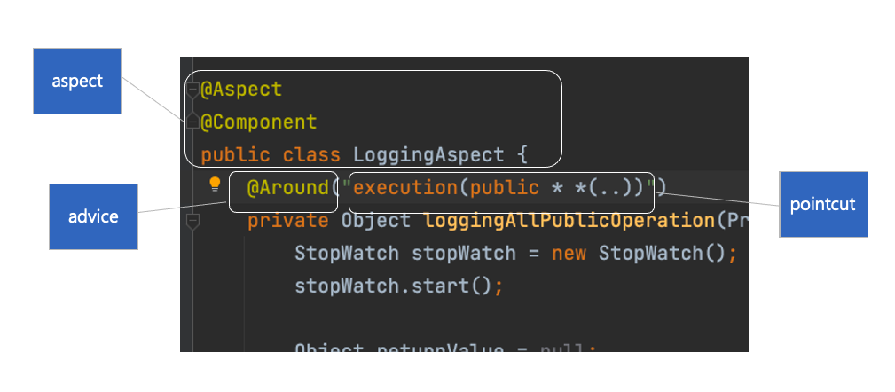
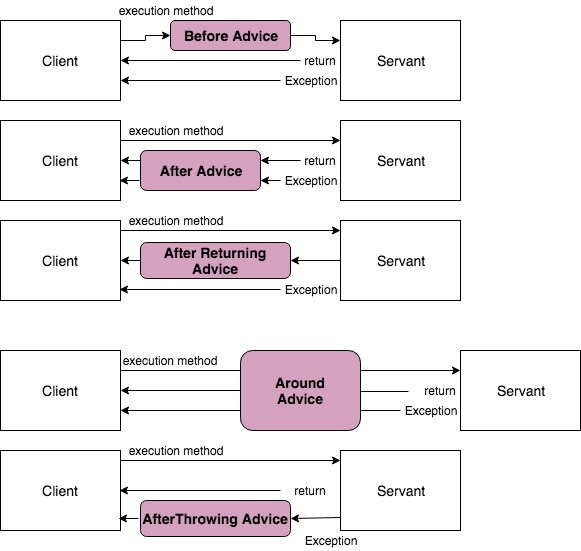

# Aspect Oriented Programming (AOP)

> 관점이라는 특별한 클래스를 만들어서 클래스와 클래스를 조합해주고 공통된 코드를 하나로 묶는다.

- 프로그램 구조를 다른방식으로 생각하게 함으로써 OOP를 보완 - OOP의 확장
- OOP에서 모듈화의 핵심 단위는 클래스이지만, AOP에서 모듈화의 핵심 단위는 `관점(aspect)` 이다.
- **관점(aspect)** : 다양한 타입과 객체에 걸친 트랜잭션 관리같은 관심(concern)을 모듈화 할 수 있게 한다.
    - crosscutting concerns(횡단 관심사) : 중복되는 관심사
    - core concerns(주요 관심사)


#### 횡단 관심사와 주요 관심사를 분리하여 관점 별로 각각 기능을 모듈화 하자


## 주요 용어

### Aspect

- 여러 클래스에 걸친 횡단 관심사 모듈 (ex. Logging, Exception Handling, Transaction etc.)
- 하나 이상의 Pointcut + Advice 조합
- Spring framework - `@Aspect`를 클래스 선언부 상단에 써준다.
- XML에서도 설정할 수 있음.

### Join Point

- 어떤 위치에 기능을 넣어야하는지 결정
- Pointcut 후보
- Spring AOP 에서는 `메서드 실행`만 대상

### Advice

- 특정 Join Point에서 Aspect가 취하는 행동
- ex. around, before, after

### Pointcut

- Advice를 적용할 Join Point를 선별하는 작업
- Advice는 Pointcut 표현식과 연결, Pointcut이 매치한 Join Point에서 실행

### Target Object

- 부가 기능을 부여할 대상
- 하나 이상의 Aspect로 Advised된 객체 (Advised Object)
- ex. Logging이라는 기능이 추가된 대상

### AOP Proxy

- aspect 계약 (어드바이스 메서드 실행 등)을 위해 AOP에 의해서 생성된 객체

### Advisor

- Pointcut과 Advice를 하나씩 갖고 있는 객체
- 스프링 AOP에서만 사용되는 용어

### Weaving

- 다른 어플리케이션 타입이나 어드바이즈된 객체를 생성하는 객체와 관점을 연결하는 행위를 의미


### Spring AOP vs @AspectJ

**Spring AOP**

- AOP 개념을 스프링 빈(Spring Bean)에 적용하기 위한 것.
- Spring Bean 대상이므로 **ApplicationContext** 가 처리한다
- 런타임 Weaving

**AspectJ**

- AOP 개념을 모든 객체에 적용하기 위한것
- 컴파일 시점, 로드시점 Weaving

## @AspectJ (Annotation) 지원

- @AspectJ 스타일은 일반 java 에 annotation 을 설정하는 방식입니다.
- 스프링 프레임워크는 AspectJ 5 의 anntation 을 사용하지만 AspectJ의 컴파일러나 위버(Weaver) 를 사용하지 않습니다.
    - e.g. import org.aspectj.lang.annotation.Aspect

## @AspectJ 지원 활성화

Java @configuration 에서 @AspectJ 지원을 활성화 하려면 @EnableAspectJAutoProxy 를 사용하여 설정합니다.

```java
@Configuration
@EnableAspectJAutoProxy
public class AppConfig {

}
```

## Aspect 선언

@AspectJ 지원을 활성화 한 후 Bean으로 선언하고, `@Aspect` 어노테이션을 설정하면 해당 스프링빈은 Aspect가 된다.

```java
@Aspect
@Componet
public class LoggingAspect {
  ...
}
```

### AspectJ 사용 요약



## 포인트컷 (@Pointcut)

> Aspect Class를 작성한다면, @Aspect, @Component 어노테이션을 클래스가 가지고 있어야 한다

- 타겟의 여러 조인포인트 중 **어드바이스를 적용할 대상(클래스) 지정**하는 키워드
- 스프링 AOP는 스프링 빈의 메서드 실행 조인 포인트만 지원
- 포인트컷 선언은 `포인트컷 표현식(pointcut expression)`과 `포인트컷 시그니처(pointcut signature)`로 구성
- 정교해야되고 명확해야 함
```java
@Pointcut("execution(* transfer(..)") // the pointcut expression
private void anyOldTransfer() {} // the pointcut signature
```

### Pointcut Expression
```java
@Pointcut(
          "execution("                           // Pointcut Designator
           + "[접근제한자 패턴] "                   // public
           + "리턴타입 패턴"                       // long
           + "[패키지명, 클래스 경로 패턴]"          // com.nhnacademy.GreetingService
           + "메소드명 패턴(파라미터 타입 패턴|..)"   // .greet(User, String)
           + "[throws 예외 타입 패턴]"            
           +")"   
          )

// ex.
@Pointcut("execution(public boolean com.nhnacademy.edu.springframework.greeting.service.Greeter.sayHello(..)")

```

### 포인트컷 지정자 - Pointcut Designator

1. execution
   - 메서드 실행 조인포인트와 매칭
   - 스프링 AOP의 주요 포인트컷 지정자
2. within
   - 주어진 타입(클래스)로 조인 포인트 범위를 제한

> **execution vs within**
> - execution : 메서드 지칭
> - within : 클래스 지칭


3. this
   - 스프링 AOP Proxy 객체에 매칭
   - Proxy 객체에 Advice 파라미터에 바인딩하는 용도로 사용
4. target
   - 주어진 타입을 구현한 타겟 객체에 매칭
   - 타겟 객체를 Advice 파라미터에 바인딩하는 용도로 사용
5. `bean`
- 스프링 AOP에서 지원하는 추가적인 포인트컷 지정자
- 스프링 빈 이름에 해당하는 메서드 실행을 매칭
```java
bean(idOrNameOfBean)

bean(*Service)
```

6. args
   - this와 within이랑 같이 주로 사용한다.

7. @target
   - 어떤 어노테이션을 가진 모든 타겟 객체의 메서드 실행
   - ex. `@target(org.springframework.transaction.annotation.Transactional)`

### 포인트컷 - 조합
- 포인트컷 표현식은 &&, ||, !으로 조합할 수 있다.
```java
// anyPublicOperation 포인트컷은 모든 public 메소드 실행에 매칭 됩니다.
@Pointcut("execution(public * *(..))")
private void anyPublicOperation() {} 

// inTrading 포인트컷은 com.xyz.myapp.trading 패키지 내의 메소드 실행에 매칭
@Pointcut("within(com.xyz.myapp.trading..*)")
private void inTrading() {} 

// tradingOperation 포인트컷은 com.xyz.myapp.trading 패키지 내의 퍼블릭 메소드 실행에 매칭
@Pointcut("anyPublicOperation() && inTrading()")
private void tradingOperation() {} 
```

## Advice
- 메서드 실행 전 후, 전/후를 결정하기 위해 사용

| 형태              | 설명                                   |
|-----------------|--------------------------------------|
| Before          | Join Point 앞에서 실행할 Advice            |
| After	          | Join Point 뒤에서 실행할 Advice            |
| AfterReturning	 | Join Point가 완전히 정상 종료한다음 실행하는 Advice |
| Around	         | Join Point 앞과 뒤에서 실행되는 Advice        |
| AfterThrowing   | 	Join Point에서 예외가 발생했을때 실행되는 Advice  |




> Advice에 Pointcut signature를 넣을 수 있다.

Object, Throwable같은 최상위 객체를 파라미터로 받고 instance of를 활용하여 처리하는게 best!

