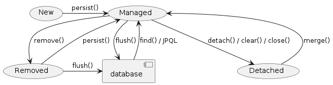

# 목차

1. 관계형 데이터베이스와 ORM
2. JPA
3. Entity Mapping

## 1. 관계형 데이터베이스와 ORM

### 데이터베이스

- 데이터를 효율적으로 관리하기 위한 일종의 창고
- 특정 조직의 여러 사용자가 데이터를 공유하여 사용할 수 있는 통합 저장된 데이터 집합

### 관계형 데이터베이스 (Relational Database)

- 데이터를 컬럼과 로우를 이루는 하나 이상의 테이블(관계)로 정리
- PK(Primary Key) : 행(row) = 레코드 = 튜플 식별

### JDBC API


- DriverManage vs. DataSource
    - DriverManager 는 데이터베이스의 상세한 정보(호스트, 포트, 사용자이름, 패스워드)를 제공해 주어야 Connection 을 받아 올 수 있습니다.
    - DataSource 는 **Connection Pooling** 을 제공합니다. 따라서 성능에 대한 확장성이 좋습니다.

- Connection Pool : 미리 Connection을 만들어 놓고 필요할 경우 제공 후 다시 받아오는 형태
    - connection을 만들 때 비용이 많이 들어서 사용

> ### H2 DB
> INIT=RUNSCRIPT FROM '***.sql'를 통해 H2 DB가 시작될 때 해당 스크립트를 실행시킨다.
> ```java
> dataSource.setUrl("jdbc:h2:~/spring-jpa;DATABASE_TO_UPPER=false;" 
>                 + "INIT=RUNSCRIPT FROM 'classpath:/script/schema.sql'");
> ```

## ORM (Object-Relational Mapping)

- ORM 프레임워크가 중간에서 객체와 관계형 데이터베이스 Mapping
- ORM을 이용하면 DBMS 벤더마다 다른 SQL에 대한 종속성을 줄이고 호환성 향상이 가능

# JPA (Java Persistence API)

- Java ORM 기술 표준

> Java EE(J2EE)는 뭘까
> Jakarta EE는 뭐야 (https://www.samsungsds.com/kr/insights/java_jakarta.html)

servlet : spec(API)이고, 이 스펙대로 구현한게 tomcat

EJB 때문에 나온 spring과 Hibernate...

## Spring Data

- 다양한 데이터 저장소에 대한 접근을 추상화하기 위한 Spring Project
- JPA, JDBC, Redis, MongoDB, Elasticsearch etc.

## Spring Data JPA

- repository 추상화를 통해 interface 선언만으로도 구현 가능
- 메서드 이름으로 쿼리 생성
- Web Support

> Transaction : 논리적 기능을 수행하기 위한 작업 단위, 일련의 연산

## Spring Framework 트랜잭션 추상화

### PlatformTransactionManager

- Spring Framework 트랜잭션 추상화의 핵심 interface

```java
public interface PlatformTransactionManager extends TransactionManager {
    TransactionStatus getTransaction(TransactionDefinition definition) /*..*/;

    void commit(TransactionStatus status) throws TransactionException;

    void rollback(TransactionStatus status) throws TransactionException;
}
```

- method에 `@Transactionl` 어노테이션을 통해
    - AOP로 구현되어 있음 -> public method가 아니면 오류가 난다!
    - 즉, spring이 만든 proxy 안에서 실행이 됨
    - self 참조는 안됨 - 자기 자신을 빈으로 만들고 주입을 받아서 하는 방식으로 처리 가능
    - `All or Nothing` 효과가 나게된다.

```java

@EnableJpaRepositories(basePackageClasses = RepositoryBase.class)
@Configuration
public class JpaConfig {

    @Bean
    public LocalContainerEntityManagerFactoryBean entityManagerFactory(DataSource dataSource) {
        LocalContainerEntityManagerFactoryBean emf = new LocalContainerEntityManagerFactoryBean();
        emf.setDataSource(dataSource);
        emf.setPackagesToScan("com.nhnacademy.springjpa.entity");
        emf.setJpaVendorAdapter(jpaVendorAdapters());
        emf.setJpaProperties(jpaProperties());

        return emf;
    }

    @Bean
    public PlatformTransactionManager transactionManager(EntityManagerFactory entityManagerFactory) {
        JpaTransactionManager transactionManager = new JpaTransactionManager();
        transactionManager.setEntityManagerFactory(entityManagerFactory);

        return transactionManager;
    }


    private JpaVendorAdapter jpaVendorAdapters() {
        HibernateJpaVendorAdapter hibernateJpaVendorAdapter = new HibernateJpaVendorAdapter();
        hibernateJpaVendorAdapter.setDatabase(Database.H2);

        return hibernateJpaVendorAdapter;
    }

    private Properties jpaProperties() {
        Properties jpaProperties = new Properties();
        jpaProperties.setProperty("hibernate.show_sql", "true");
        jpaProperties.setProperty("hibernate.format_sql", "true");
        jpaProperties.setProperty("hibernate.use_sql_comments", "true");
        jpaProperties.setProperty("hibernate.globally_quoted_identifiers", "true");
        jpaProperties.setProperty("hibernate.temp.use_jdbc_metadata_defaults", "false");

        return jpaProperties;
    }

}

```

## Entity ?

- JPA를 이용해서 데이터베이스 테이블과 맵핑할 클래스
- ORM Framework가 자동으로 query로 작성할 수 있도록 정보를 제공해주는 역할!
- DB 테이블과 자바 클래스와 매핑하는데 이것을 Entity

## then, what is EntityManager ?

> Java Collection ? : Map, Set, List와 같이 데이터를 관리하는 메서드 제공

- Collection과 같이 Entity를 관리하는 메서드를 제공하는 것을 `EntityManager`
- Entity의 저장, 수정, 삭제, 조회 등 Entity와 관련된 모든 일을 처리하는 관리자
    - cache 역할을 해줌 -> 이미 알고있는 테이블
    - 만약에 insert 3번을 해도 cache로 응답을 하고 1번만 실제로 연산이 일어날 수 있음
    - 그럼 조회를 할 때는?

## EntityManagerFactory

- EntiytManager를 생성하는 팩토리
- 데이터베이스를 하나만 사용하는 애플리케이션은 일반적으로 **EntityManagerFactory**를 하나만 사용
- EntityManagerFactory를 만드는 비용이 매우 크기 때문에 하나만 만들어서 전체에서 공유
    - `thread safe`

## EntityManager

- Entity의 저장, 수정, 삭제, 조회 등 Entity와 관련된 모든 일을 처리하는 관리자
- EntityManagerFactory 가 생성 → 생성 비용이 크지 않다
- EntityManager는 thread safe 하지 않음
    - 여러 thread 간에 절대 공유하면 안 됨
- 각각의 요청마다 별도의 EntityManager를 생성해서 사용

> **JPA는 Transaction Manager가 무조건 필요하다**

### SQL

- JPA가 만든 쿼리를 로그로 보고싶다면?

_JPA Properties_

```properties
hibernate.show-sql=true 
hibernate.format_sql=true
```

_logback logger_

```xml

<logger name="org.hibernate.SQL" level="debug" additivity="false">
    <appender-ref ref="console"/>
</logger>
```

### binding parameters

```java
<logger name="org.hibernate.type.descriptor.sql.BasicBinder"level="trace"additivity="false">
    <appender-
ref ref = "console" / >
</logger>
```

# Entity Mapping

- Entity Class에 데이터베이스 테이블과 컬럼, PK, FK 등을 설정

## Annotation

- @Entity : JPA가 관리할 객체임을 명시 (class)
- @Table : Mapping할 DB Table명 지정 (class)
- @Id : PK Mapping (Field)
- @Column : Filed와 Column Mapping (생략 가능, name을 지정해서도 가능)

```java

@Entity
@Table(name = "Members")
public class Member {
    @Id
    @GeneratedValue(strategy = GenerationType.IDENTITY)
    private Long id;

    private String name;

    @Column(name = "created_dt")
    private LocalDateTime createdDate;

}
```

### @Temporal

- 날짜 타입 매핑
- LocalTime, LocalDate, ZoneDateTime과 같은 타입은 붙이지 않음

```java
public enum TemporalType {
    DATE,
    TIME,
    TIMESTAMP
}
```

### @Transient

- Java 객체에서 테이블로 매핑할 때 제외시킬 필드에 어노테이션

## Primary Key Mapping 전략

### 자동 생성

1. TABLE : 채번 테이블 사용
2. SEQUENCE : 데이터베이스 시퀀스 사용하여 기본 키 할당 (Oracle)
3. IDENTITY : 기본 키 생성을 데이터베이스에 위임 (MySQL)
4. AUTO : 선택한 데이터베이스 방언(dialect)에 따라 PK 매핑 전략을 자동으로 선택

## 복합 키 (Composite key)

- @IdClass
- @EmbeddedId / @Embeddable

### 1. `@IdClass`

```java

@Entity
@Table(name = "OrderItems")
@IdClass(OrderItem.Pk.class)  // inner class
public class OrderItem {
    @Id
    @Column(name = "order_id")
    private Long orderId;

    @Id
    @Column(name = "line_number")
    private Integer lineNumber;

    // ...

    @NoArgsConstructor
    @AllArgsConstructor
    @EqualsAndHashCode
    public static class Pk implements Serializable {
        private Long orderId;

        private Integer lineNumber;

    }
}
```

### 2. `@EmbeddedId` / `@Embeddable`

- `@EmbeddedId` - Entity 클래스의 필드에 지정
- `@Embeddable` - 복합 Key 식별자 클래스에 지정

```java

@Entity
@Table(name = "OrderItems")
public class OrderItem {
    @EmbeddedId
    private Pk pk;

    // ...


    @NoArgsConstructor
    @AllArgsConstructor
    @EqualsAndHashCode
    @Embeddable
    public static class Pk implements Serializable {
        @Column(name = "order_id")
        private Long orderId;

        @Column(name = "line_number")
        private Integer lineNumber;

    }
}
```

> ### PK 제약 조건 = Composite Key Class 제약 조건
> 1. The primary key class must be **public** and must have a **public no-arg constructor**.
> 2. The primary key class must be **serializable**.
> 3. The primary key class must define **equals** and **hashCode** methods.

# JPA Setting

1. `@EnableJpaRepositories(basePackageCalsses = Repository.Base)` : JPA 대상 영역으로 지정
2. JPATransactionManager - Query

```java

@EnableJpaRepositories(basePackageClasses = RepositoryBase.class)
@Configuration
public class JpaConfig {
    @Bean
    public LocalContainerEntityManagerFactoryBean entityManagerFactory(DataSource dataSource) {
        LocalContainerEntityManagerFactoryBean emf = new LocalContainerEntityManagerFactoryBean();
        emf.setDataSource(dataSource);
        emf.setPackagesToScan("com.nhnacademy.springjpa.entity");
        emf.setJpaVendorAdapter(jpaVendorAdapters());
        emf.setJpaProperties(jpaProperties());

        return emf;
    }

    // 어떤 DB를 쓰냐에 따라 쿼리문이 달라짐 - 어떤 데이터베이스인지 알려줘야 함.
    private JpaVendorAdapter jpaVendorAdapters() {
        HibernateJpaVendorAdapter hibernateJpaVendorAdapter = new HibernateJpaVendorAdapter();
        hibernateJpaVendorAdapter.setDatabase(Database.H2);

        return hibernateJpaVendorAdapter;
    }

    // jpa 설정
    private Properties jpaProperties() {
        Properties jpaProperties = new Properties();
        jpaProperties.setProperty("hibernate.show_sql", "true");
        jpaProperties.setProperty("hibernate.format_sql", "true");
        jpaProperties.setProperty("hibernate.use_sql_comments", "true");
        jpaProperties.setProperty("hibernate.globally_quoted_identifiers", "true");
        jpaProperties.setProperty("hibernate.temp.use_jdbc_metadata_defaults", "false");

        return jpaProperties;
    }

    @Bean
    public PlatformTransactionManager transactionManager(EntityManagerFactory entityManagerFactory) {
        JpaTransactionManager transactionManager = new JpaTransactionManager();
        transactionManager.setEntityManagerFactory(entityManagerFactory);

        return transactionManager;
    }

}
```

## 영속성 컨텍스트

- `@PersistenceContext` : entity를 영구 저장하는 환경

> Persistence Context - EntityManager가 관리하는 그 무엇

### 영속성 컨텍스트가 Entity를 관리하면 얻을 수 있는 이점

- 1차 캐시
    - 한 번 참조된 Entity는 Map(내부 저장소)에 저장
- 동일성 보장
- 트랜잭션을 지원하는 쓰기 지연
- 변경 감지
    - Application에서 속성을 변경 -> JPA가 알아서 DB에 넣음
- 지연 로딩

## Entity Life cycle



- 비영속 (new/transient) : 영속성 컨텍스트와 전혀 관계 없는 상태
- 영속 (managed) : 영속성 컨텍스트에 저장된 상태
- 준영속 (detached) : 영속성 컨텍스트에 저장되었다가 분리된 상태
- 삭제 (removed) : 삭제된 상태

