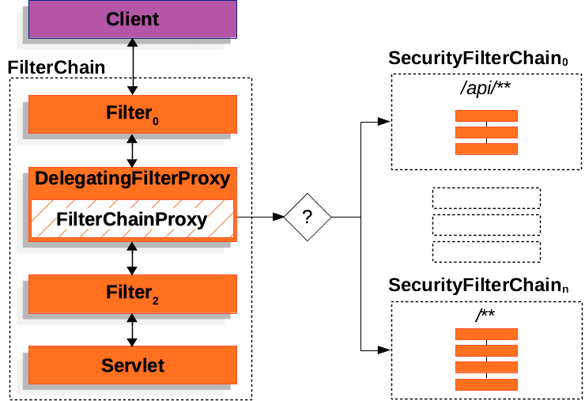

# Spring Security

- `Acegi Security`

## 다양한 인증(Authentication) 지원

- HTTP Basic Authentication headers
- HTTP Digest Authentication headers
- Form-based authentication (ID/Password 인증)
- LDAP
- OAuth2.0
- SAML 2.0

## 권환 관리 (Authorization)

- 웹 요청 표현식 기반 접근제어 (Expression-Based Access Control)
- Method Security
- Domain Object Security (ACLs)

## 취약점 공격 방어

- Security Http Response Headers
- CSRF

### 기본 모듈

- Core : spring-security-core 
  - core authentication, access-control


- Config : spring-security-config 
  - XML namespace configuration 
  - Java Config


- Web : spring-security-web 
  - filters, web security infrastructure


- Taglibs: spring-security-taglibs 
  - JSP tag 구현

### 고급 모듈

- ACL : spring-security-acl
    - domain object ACL
- Remoting : spring-security-remoting
    - provides integration with Spring Remoting
- Test : spring-security-test
    - support for testing with Spring Security

### 인증 모델별 모듈

- LDAP : spring-security-ldap
- CAS : spring-security-cas
- OpenID : spring-security-openid

# Spring Security 설정

_pom.xml_
```xml
<dependencyManagement>
    <dependencies>
        <dependency>
            <groupId>org.springframework.security</groupId>
            <artifactId>spring-security-bom</artifactId>
            <version>5.8.3</version>
            <type>pom</type>
            <scope>import</scope>
        </dependency>
    </dependencies>
</dependencyManagement>
```

## WEb Request ACL Spring Expression

```java
    @Bean
    public SecurityFilterChain securityFilterChain(HttpSecurity http) throws Exception {
        return http.authorizeHttpRequests()
                .requestMatchers("/admin/**").hasAuthority("ROLE_ADMIN")
                .requestMatchers("/private-project/**").hasAnyAuthority("ROLE_ADMIN", "ROLE_MEMBER")
                .requestMatchers("/project/**").authenticated()
                .requestMatchers("/redirect-index").authenticated()
                .anyRequest().permitAll()
                .and()
            .formLogin()
                .and()
            .logout()
                .and()
            .csrf()
                .disable()
            .sessionManagement()
                .sessionFixation()
                    .none()
                .and()
            .build();
    }
```

- requestMatchers({url}).hasAuthority({authority});
- anyRequest().permitAll() 이외의 모든 요청 OK
- 페이지 접근에 대한 제어를 다음과 같이 적용할 수 있다.


> Spring Security는 Servlet Filter 구조로 이루어져 있음 !!  
> 
> 

